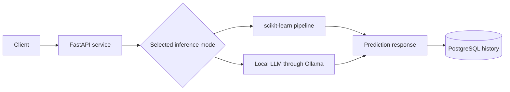
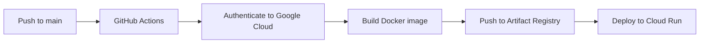

<div align="center">

# ML Model Serving and Deployment Demo

### FastAPI · Docker · PostgreSQL · GitHub Actions · Google Cloud Run

This repository demonstrates an end-to-end MLOps workflow for serving a machine-learning model behind an API, persisting predictions and deploying a container automatically to Google Cloud Run.


</div>

---

## Purpose

The primary objective of this project is to demonstrate the engineering lifecycle around a machine-learning model:

1. expose model inference through FastAPI;
2. package the service with Docker;
3. persist prediction history in PostgreSQL;
4. build and push container images;
5. deploy automatically with GitHub Actions;
6. operate the service through health and history endpoints.

The prediction task uses first-name classification as a compact educational example. The repository should be evaluated as an **MLOps and model-serving demonstration**, not as a system for determining a person's identity.

---

## Architecture



Deployment flow:



---

## API capabilities

| Endpoint | Purpose |
| --- | --- |
| `/predict` | Run a prediction using the selected model |
| `/history` | Return recent persisted predictions |
| `/health` | Verify service availability |

Example request:

```http
GET /predict?name=Marie&model=classic
```

Example response:

```json
{
  "name": "Marie",
  "model": "classic",
  "prediction": "female"
}
```

---

## Inference modes

### Classical machine-learning pipeline

The classical model uses character-level information with:

- `CountVectorizer`;
- character patterns and n-grams;
- a scikit-learn classifier;
- a serialized model artifact.

### Local LLM comparison

An alternative mode sends a constrained classification prompt to an Ollama-served model.

This mode is included to compare two serving patterns:

- a small deterministic classifier;
- a locally hosted general-purpose language model.

It is not assumed that the LLM is the better solution. A proper comparison should include accuracy, latency, cost, calibration and robustness.

---

## Data persistence

Predictions are stored in PostgreSQL using a structure equivalent to:

```sql
CREATE TABLE predictions (
    id SERIAL PRIMARY KEY,
    name TEXT,
    model TEXT,
    prediction TEXT,
    created_at TIMESTAMP
);
```

The history endpoint demonstrates how inference results can be persisted and retrieved by an application layer.

---

## Repository structure

```text
gender-prediction-api/
├── app.py
├── model.joblib
├── requirements.txt
├── Dockerfile
├── docker-compose.yml
├── .github/
│   └── workflows/
│       └── deploy.yml
└── README.md
```

Local environment variables should be stored in an uncommitted `.env` file.

---

## Run locally

### Requirements

- Docker;
- Docker Compose;
- Python 3.11 for non-container development;
- Ollama only when testing the optional LLM mode.

### Start the stack

```bash
docker compose up --build
```

The API documentation is then available at:

```text
http://localhost:8001/docs
```

### Example local configuration

```env
DB_HOST=db
DB_NAME=genderdb
DB_USER=genderuser
DB_PASSWORD=replace_with_a_local_password

OLLAMA_URL=http://host.docker.internal:11434
OLLAMA_MODEL=your_local_model
```

Do not commit real credentials or cloud service-account keys.

---

## CI/CD workflow

A push to `main` triggers a GitHub Actions workflow that:

1. checks out the repository;
2. authenticates to Google Cloud using a GitHub secret;
3. configures Docker for Artifact Registry;
4. builds and pushes the image;
5. deploys the image to Cloud Run.

The deployment workflow is implemented in:

```text
.github/workflows/deploy.yml
```

The current workflow uses an unauthenticated Cloud Run deployment for demonstration. A real service handling personal or sensitive data should require authentication, rate limiting, audit logging and stricter network controls.

---

## Responsible-use note

Inferring gender from a first name is inherently limited and can be wrong for cultural, linguistic, personal and non-binary reasons.

This repository does **not** claim that:

- a name determines a person's gender identity;
- predictions are appropriate for consequential decisions;
- the model is equally reliable across countries or languages;
- an LLM answer is authoritative.

The task is retained only as a compact model-serving example. It should not be used for profiling, eligibility, access control or decisions about individuals.

---

## Current limitations

- no confidence or calibration output;
- no model card with subgroup evaluation yet;
- no authentication on the demonstration deployment;
- no rate limiting;
- no automated unit or integration test workflow;
- no observability dashboard;
- no model registry or version comparison;
- no automated retraining or drift detection;
- no Terraform configuration for the cloud resources.

---

## Recommended next milestones

1. add unit, API and integration tests;
2. separate training code from inference artifacts;
3. add prediction confidence and calibration;
4. create a model card and subgroup error analysis;
5. add structured logging, metrics and tracing;
6. protect the deployed API with authentication and rate limiting;
7. manage infrastructure with Terraform;
8. add model versioning and champion/challenger comparison;
9. replace the educational task with a less identity-sensitive benchmark.

---

## What this project demonstrates

- model serving with FastAPI;
- containerized local development;
- PostgreSQL integration;
- comparison of classical ML and locally served LLM inference;
- automated image build and cloud deployment;
- understanding of the gap between a technical demo and a production ML service.

---

## Author

**Alex Komla LABOU**  
Applied AI and Machine Learning Engineer — Research-Oriented

- GitHub: [EL-K-Code](https://github.com/EL-K-Code)
- LinkedIn: [komla-alex-labou](https://www.linkedin.com/in/komla-alex-labou/)
